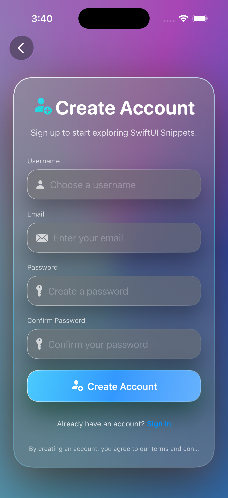
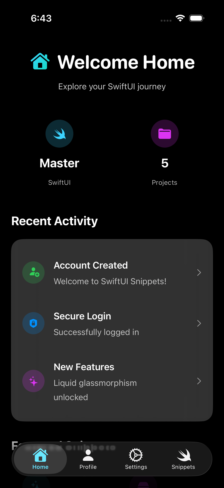

# SwiftUI-Snippets – Liquid Glassmorphism Auth Dashboard

A production-ready SwiftUI application featuring stunning iOS 26-style liquid glassmorphism design, complete authentication system with SwiftData persistence, tabbed dashboard with glass cards, and clean architecture implementation.

## ✨ Features

### 🎨 **Liquid Glass UI Design**
- **iOS 26 Aesthetic**: Vibrant angular gradients, ultra-thin material blur, and layered shadows
- **Glassmorphism Cards**: Frosted glass containers with gradient borders and dual shadows
- **Smooth Animations**: Fluid transitions between states with custom easing
- **Consistent Theming**: Unified color palette across all screens

### 🔐 **Complete Authentication System**
- **User Registration**: Username, email, password with validation and confirmation
- **Secure Login**: Username/password authentication with SwiftData persistence
- **Forgot Password**: Reset password functionality with email verification flow
- **Session Management**: Persistent login state across app launches using UserDefaults
- **Auto-Navigation**: Seamless transitions between auth states and dashboard

### 📱 **Advanced Dashboard with Glass Cards**
- **Tabbed Navigation**: Bottom tab bar with Home, Profile, Settings, and Snippets tabs
- **Shared Background**: Same liquid gradient background as login screen for seamless experience
- **Glassmorphism Cards**: Enhanced glass containers with gradient backgrounds and shadows
- **Home Tab**: Welcome screen with activity feed, stats cards, and featured snippets
- **Profile Tab**: User profile with avatar, session tracking, and info cards in glass containers
- **Settings Tab**: App preferences with dark mode toggle, notifications, and action cards
- **Snippets Tab**: SwiftUI techniques showcase with grid layout and glass card containers
- **Interactive Elements**: Toggle switches, buttons, and navigation all with glass effects
- **Performance Optimized**: Efficient rendering with shared backgrounds and optimized layouts

### 🏗️ **Clean Architecture & SwiftData**
- **SwiftData Integration**: Local user storage with unique constraints and predicates
- **Repository Pattern**: Clean separation between data access and business logic
- **Use Cases**: Dedicated business logic for login, register, and password reset
- **MVVM Pattern**: Observable view models with proper state management

### 🎯 **Advanced Features**
- **Persistent Sessions**: User stays logged in between app launches
- **Session Tracking**: Dashboard shows login duration and user info
- **Custom Tab Bar**: Glassmorphism UITabBar with themed colors and blur effects
- **Form Validation**: Real-time validation with helpful error messages
- **Loading States**: Beautiful progress indicators during async operations
- **Error Handling**: Comprehensive error states with user-friendly messages
- **Glass Card Components**: Reusable StatCardView, ActivityRow, and ProfileInfoCard

## 📱 Screenshots

| Login Screen | Register Screen |
|-------------|----------------|
|  |  |

| Dashboard |
|-----------|
|  |


## 🗂️ Project Structure

```
SwiftUI-Snippets/
├── SwiftUI_SnippetsApp.swift          # App entry point with SwiftData setup
├── RootView.swift                     # Root navigation controller
├── ContentView.swift                  # Initial content view
├── Components/
│   ├── AppButtonView.swift           # Reusable glass button component
│   ├── AppTextFieldView.swift        # Reusable glass text field component
│   └── UserSessionManager.swift      # UserDefaults session management
├── Clean-Architecture/
│   ├── Domain/
│   │   ├── Entities/
│   │   │   └── User.swift            # User domain model
│   │   ├── Repositories/
│   │   │   └── AuthRepository.swift  # Auth repository protocol
│   │   └── UseCases/
│   │       ├── LoginUseCase.swift
│   │       ├── RegisterUseCase.swift
│   │       └── ResetPasswordUseCase.swift
│   ├── Data/
│   │   ├── Local/
│   │   │   └── LocalUserStore.swift  # SwiftData user storage
│   │   ├── Network/
│   │   │   └── ApiClient.swift       # HTTP client (placeholder)
│   │   └── Repositories/
│   │       └── AuthRepositoryImpl.swift  # Auth repository implementation
│   └── Presentation/
│       ├── ViewModels/
│       │   ├── LoginViewModel.swift
│       │   ├── RegisterViewModel.swift
│       │   ├── ForgotPasswordViewModel.swift
│       │   └── DashboardViewModel.swift
│       └── Views/
│           ├── AuthRootView.swift     # Auth navigation container
│           ├── LoginView.swift        # Login screen with liquid glass
│           ├── RegisterView.swift     # Registration screen
│           ├── ForgotPasswordView.swift  # Password reset screen
│           └── DashboardView.swift    # Post-login dashboard with tabs
├── ScrollViews/
│   └── ScrollableVideoView.swift     # Video scroll view component
├── Preview Content/
│   └── Preview Assets.xcassets/      # Preview assets
└── Assets.xcassets/                  # App assets and icons
```

## 🔄 App Flow & Navigation

### **Authentication Flow**
1. **App Launch** → `RootView` checks `UserSessionManager.isLoggedIn`
2. **Not Logged In** → Show `AuthRootView` (Login/Register/Forgot Password)
3. **Registration** → Create account → Auto-login → Navigate to Dashboard
4. **Login** → Authenticate → Navigate to Dashboard
5. **Logged In** → Show `DashboardView` directly

### **Navigation Architecture**
- **`NavigationStack` + `NavigationPath`**: Type-safe navigation with enum routes
- **`AuthRoute` Enum**: `.login`, `.register`, `.forgotPassword` routes
- **State Management**: Notification-based communication between views
- **Session Persistence**: UserDefaults for login state across app launches

## 🛠️ Technical Implementation

### **SwiftData Integration**
```swift
@Model
final class LocalUserEntity {
    @Attribute(.unique) var username: String
    var password: String
    var email: String

    init(username: String, password: String, email: String) {
        self.username = username
        self.password = password
        self.email = email
    }
}

final class LocalUserStore {
    private let context: ModelContext

    func saveUser(username: String, password: String, email: String) {
        // Implementation with unique constraints
    }

    func findUser(username: String, password: String) -> LocalUserEntity? {
        // Query with predicates
    }
}
```

### **Session Management**
```swift
final class UserSessionManager {
    var isLoggedIn: Bool { /* UserDefaults check */ }
    func saveLoginSession(username: String, userId: Int) { /* ... */ }
    func clearSession() { /* ... */ }
}
```

### **Clean Architecture Layers**
- **Domain**: Business logic and entities (User, AuthRepository protocol, UseCases)
- **Data**: SwiftData repositories, network layer, and data persistence
- **Presentation**: SwiftUI views and view models with MVVM pattern

## 📋 Requirements

- **Xcode**: 15.0+ (Swift 6.0 support required for SwiftData)
- **iOS**: 17.0+ (SwiftData requires iOS 17+)
- **Swift**: 6.0+ (for SwiftData and modern SwiftUI features)

## 🚀 Running the App

1. **Clone/Open Project**
   ```bash
   cd "/path/to/SwiftUI-Snippets"
   open SwiftUI-Snippets.xcodeproj
   ```

2. **Select Simulator**
   - Choose iPhone 15 Pro or iPhone 16 simulator
   - Ensure **SwiftUI-Snippets** scheme is selected

3. **Build & Run**
   - Press `⌘ + R` or click ▶️ button
   - First launch may take longer due to SwiftData setup
   - Wait for simulator to launch

4. **Test the Complete Flow**
   - **Registration**: Create account → auto-login → dashboard tabs
   - **Login**: Enter credentials → access dashboard with session tracking
   - **Forgot Password**: Reset password → login with new credentials
   - **Persistence**: Close/reopen app → stay logged in with session data
   - **Dashboard**: Explore Home, Profile, Settings, and Snippets tabs
   - **Dark Mode**: Go to Settings tab → toggle "Dark Mode" → see theme change
   - **Theme Persistence**: Close/reopen app → theme preference remembered
   - **Logout**: Clear session and return to login screen

## 🎨 Customization Guide

### **Color Theme**
- Update gradients in `LoginView.swift`, `RegisterView.swift`, `DashboardView.swift`
- Modify accent colors in `Assets.xcassets/AccentColor.colorset`

### **Glassmorphism Effects**
- **Ultra-thin Material**: `.ultraThinMaterial` background for frosted glass effect
- **Gradient Overlays**: Linear gradients on glass surfaces for depth
- **Stroke Effects**: Gradient borders with varying opacity
- **Dual Shadows**: Layered shadows for realistic depth perception
- **Theme Adaptive**: Different colors and intensities for light/dark modes
- **Adjust in**: `AppButtonView.swift`, `AppTextFieldView.swift`, `DashboardView.swift`

### **Enhanced Dark/Light Mode**
- **Vibrant Light Theme**: Gold, coral, mint, and peach gradients with subtle animation and enhanced saturation for a sunny, modern aesthetic
- **Deep Dark Theme**: Navy and purple gradients for elegant, sophisticated contrast
- **Adaptive Text Colors**: All text automatically adapts from white (dark mode) to black (light mode) for optimal readability
- **Adaptive Icon Colors**: Icons change gradient colors based on theme (orange/pink for light, purple/blue for dark)
- **Dynamic Animations**: Gentle gradient rotation animation in light theme for visual engagement
- **Enhanced Brightness**: Slight brightness and saturation boosts for more vivid light theme colors
- **Improved Contrast**: Better text readability with theme-appropriate overlays and adaptive colors
- **UserDefaults Persistence**: Theme preference saved across app launches
- **System Integration**: Respects system theme when dark mode disabled
- **Force Dark Mode**: Override system preference with app-specific setting
- **Visual Continuity**: Seamless transitions with adaptive UI elements

### **SwiftData Schema**
- Modify `LocalUserEntity` in `LocalUserStore.swift`
- Update migration logic if schema changes

### **Validation Rules**
- Customize password requirements in `RegisterViewModel.swift`
- Adjust email validation in view models

## 📚 Key Technologies

- **SwiftUI**: Modern declarative UI framework
- **SwiftData**: Apple's ORM for local data persistence
- **Combine**: Reactive programming for state management
- **NavigationStack**: Type-safe navigation system
- **UserDefaults**: Simple key-value storage for sessions
- **Clean Architecture**: Separation of concerns and testability

## 🔒 Security Features

- **Secure Text Fields**: `SecureField` for password input
- **Input Validation**: Client-side validation with helpful feedback
- **Session Management**: Secure logout with session cleanup
- **Data Persistence**: Local SwiftData storage (easily extensible to iCloud)

## 🎯 Learning Outcomes

This project demonstrates:
- **Modern SwiftUI Development**: Advanced patterns, custom components, and iOS 26 aesthetics
- **Clean Architecture**: Repository pattern, use cases, and MVVM implementation
- **SwiftData Integration**: Local persistence, unique constraints, and data modeling
- **Advanced Navigation**: NavigationStack, NavigationPath, and type-safe routing
- **Glassmorphism Design**: Liquid gradients, ultra-thin materials, and layered effects
- **Authentication Flow**: Complete login/register system with session management
- **State Management**: Combine, ObservableObject, and NotificationCenter
- **Component Architecture**: Reusable views, custom styling, and design systems

---

**Built with ❤️ using SwiftUI & SwiftData** – A complete authentication system ready for production apps!

