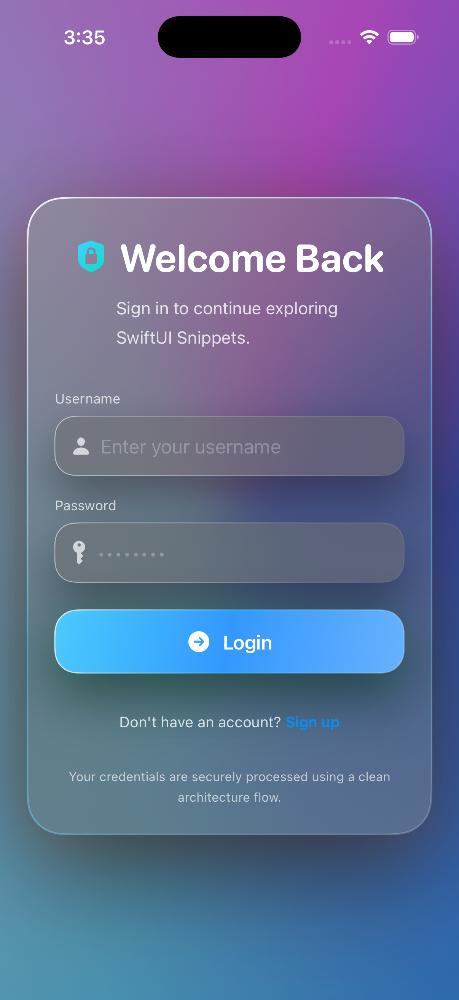
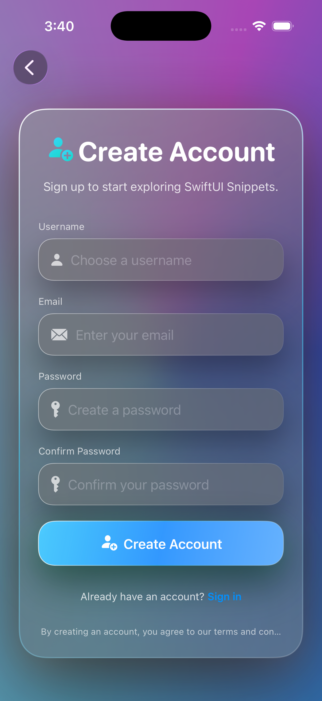
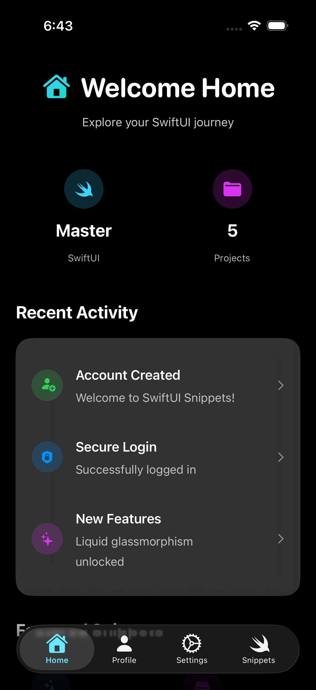

<div align="center">

# 🧪 SwiftUI Snippets

### Liquid Glassmorphism Auth Dashboard

[](https://swift.org)
[](https://developer.apple.com/ios/)
[](https://developer.apple.com/xcode/swiftui/)
[](https://developer.apple.com/xcode/swiftdata/)
[](https://opensource.org/licenses/MIT)

A production-ready SwiftUI application featuring stunning **iOS 26-style Liquid Glassmorphism** design. This project showcases a complete authentication system with SwiftData persistence, a tabbed dashboard with glass cards, and a clean architecture implementation.

[Explore Features](#-features) • [View Screenshots](#-visual-showcase) • [Setup Guide](#-getting-started) • [Tech Stack](#-core-technologies)

</div>

---

## 📱 Visual Showcase

<div align="center">
  <table style="width: 100%; border-collapse: collapse;">
    <tr>
      <td align="center" style="width: 33%; border: none;">
        <b>Login Screen</b><br>
        
      </td>
      <td align="center" style="width: 33%; border: none;">
        <b>Register Screen</b><br>
        
      </td>
      <td align="center" style="width: 33%; border: none;">
        <b>Dashboard</b><br>
        
      </td>
    </tr>
  </table>
</div>

---

## ✨ Features

### 🎨 **Liquid Glass UI Design (iOS 26 Aesthetic)**

- **Vibrant Gradients**: Deep navy/purple and bright gold/coral/mint/peach angular gradients.
- **Frosted Glassmorphism**: Ultra-thin material blur effects with layered shadows for realistic depth.
- **Animated Surfaces**: Subtle micro-animations and gradient rotations for a "living" UI.
- **Adaptive Theming**: Full support for High-Contrast Light and Deep Dark modes.

### 🔐 **Enterprise-Grade Authentication**

- **Complete Flow**: Registration, Login, and Password Reset (with email verification simulation).
- **Persistence**: Secure session management using `UserDefaults` and `SwiftData`.
- **Validation**: Real-time form validation with user-friendly error feedback.
- **Auto-Navigation**: Seamless transitions between authentication states and main dashboard.

### 🏗️ **Clean Architecture Implementation**

- **Domain Layer**: Pure business logic with Entities, Repository protocols, and UseCases.
- **Data Layer**: Persistence implementation using SwiftData and local storage logic.
- **Presentation Layer**: MVVM pattern with Combine-powered ViewModels and modular SwiftUI views.

### 📱 **Power Dashboard**

- **Tabbed Navigation**: Custom Glassmorphism tab bar with Home, Profile, Settings, and Snippets.
- **Live Sessions**: Real-time login duration tracking and user session info.
- **Reusable Components**: A library of glass components: `StatCardView`, `ActivityRow`, `ProfileInfoCard`, and more.

---

## 🛠️ Core Technologies

| Module             | technology                           |
| :----------------- | :----------------------------------- |
| **Language**       | Swift 6.0                            |
| **UI Framework**   | SwiftUI (iOS 17+)                    |
| **Persistence**    | SwiftData                            |
| **Reactive Logic** | Combine                              |
| **Navigation**     | NavigationStack & NavigationPath     |
| **Database**       | Core Data (abstracted via SwiftData) |

---

## 🗂️ Project Structure

```text
SwiftUI-Snippets/
├── 📱 Presentation/       # MVVM Views & ViewModels
├── 🧠 Domain/             # Entities, Protocols & UseCases
├── 💾 Data/               # Repositories & Local Storage
├── 🧩 Components/         # Reusable Glassmorphism UI Elements
├── 🎬 ScrollViews/        # Advanced Layout Components
└── 🎨 Assets.xcassets/    # Theme Colors & Media
```

---

## 🚀 Getting Started

### Requirements

- **Xcode 15.0+**
- **iOS 17.0+**
- **Swift 6.0+**

### Installation

1.  **Clone the Repository**
    ```bash
    git clone https://github.com/your-username/SwiftUI-Snippets.git
    cd SwiftUI-Snippets
    ```
2.  **Open in Xcode**
    ```bash
    open SwiftUI-Snippets.xcodeproj
    ```
3.  **Run the Project**
    - Select **iPhone 15 Pro** (or newer) as the target.
    - Press `⌘ + R` to build and run.

---

## 🎨 Customization Guide

### **Theming System**

Modify the global gradients to match your brand:

- **Gradients**: Check `LoginView.swift` and `DashboardView.swift`.
- **Accent Colors**: Update `Assets.xcassets/AccentColor.colorset`.

### **Glass Effects**

Tweak the frosted glass intensity:

- Edit `.ultraThinMaterial` and `.thinMaterial` overlays in `AppButtonView.swift` and `AppTextFieldView.swift`.

---

## ⚖️ License

Distributed under the MIT License. See `LICENSE` for more information.

---

<div align="center">
  <p>Built with ❤️ using <b>SwiftUI</b> & <b>SwiftData</b></p>
  <p><i>Ready for production. Designed for the future.</i></p>
</div>
